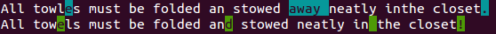

Colored diffs
=============

One practical use of colors is to make differences in text more visible.
:data:`ansicolor.colordiff` computes a diff of two strings and returns
a marked-up version of them that highlights the characters that differ
between the two.

.. literalinclude:: ../snippets/colored_diffs_1.py

