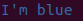

Getting started with colors
===========================

To highlight using colors:

.. literalinclude:: ../snippets/getting_started_1.py

.. figure:: ../snippets/getting_started_1.png

This will emit ansi escapes into the string: one when starting a color, another
to reset the color back to the default:

.. code:: python

    >>> from ansicolor import green

    >>> green("green")
    '\x1b[0;0;32mgreen\x1b[0;0m'

If I want to be able to pass a color as an argument I can also use the
``colorize`` function:

.. literalinclude:: ../snippets/getting_started_2.py

I can also apply color on a portion of a string:

.. literalinclude:: ../snippets/getting_started_3.py

.. figure:: ../snippets/getting_started_3.png
