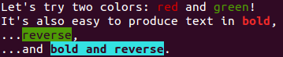
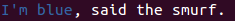

Getting started
===============

To highlight using colors:

.. literalinclude:: ../snippets/getting_started_1.py

This will emit ansi escapes into the string: one when starting a color, another
to reset the color back to the default:

.. code:: python

    >>> from ansicolor import green

    >>> green("green")
    '\x1b[0;0;32mgreen\x1b[0;0m'

If I want to be able to pass a color as an argument I can also use the
``colorize`` function:

.. literalinclude:: ../snippets/getting_started_2.py

I can also apply color on a portion of a string:

.. literalinclude:: ../snippets/getting_started_3.py

Sometimes I may have a string that contains markup and I'll want to do something
with it that concerns only the text, so I can strip the markup:

.. code:: python

    >>> from ansicolor import red
    >>> from ansicolor import strip_escapes
    >>> from ansicolor import yellow

    >>> message = "My favorite colors are %s and %s" % (yellow("yellow"), red("red"))
    >>> print("The length of this text is not: %d" % len(message))
    The length of this text is not: 67
    >>> print("The length of this text is: %d" % len(strip_escapes(message)))
    The length of this text is: 37
