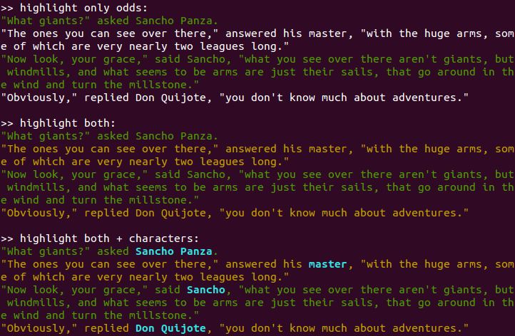

Using highlights
================

Quite often colors are used not to format all of the text in color, but to
highlight certain parts of it.
The function :data:`ansicolor.highlight_string` takes this a
bit further by allowing you to pass in a list of pairs that represent
the start and end offsets in the string that you want highlighted.

.. literalinclude:: ../snippets/using_highlights_1.py

Every list of pairs that is passed in is considered a highlighting layer
and gets a new color. Where layers overlap this is indicated by applying:

- bold (two layers overlap),
- reverse (three layers overlap),
- bold and reverse (four layers overlap).

Four layers is the maximum, because after that there is no further
distinction possible. See :data:`ansicolor.demos.demo_highlight` for an
exhaustive example.
